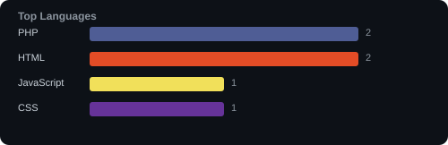
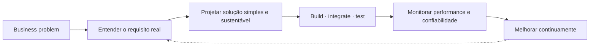

# Windson Martins

### Full Stack Developer · PHP/Laravel · JavaScript/React · Sistemas críticos & BI

6+ anos construindo e sustentando sistemas de negócio — do backend à decisão orientada por dados

 

 

## 🧭 Sobre mim

Desenvolvedor Full Stack com **mais de 6 anos** de atuação em sistemas que resolvem problemas reais de negócio — não só código que funciona, mas software que se sustenta em produção.

Tenho experiência consolidada em **sistemas críticos de operação 24/7** (ambientes hospitalares e administrativos), além de **plataformas SaaS**, **dashboards de BI**, **faturamento**, **controle de permissões** e **modernização de sistemas legados**.

Perfil orientado à entrega: transformo requisitos complexos em soluções **funcionais, seguras, escaláveis** e preparadas para operar sob uso contínuo — com atenção real a performance, segurança e organização de código.

 

## 🛠️ Stack

<table width="100%">
<tr>
<td valign="top" width="50%">

**Backend**
 

**Frontend**
 

</td>
<td valign="top" width="50%">

**Dados & Infra**
 

**E-commerce & CMS**
 

**Business Intelligence**
 

</td>
</tr>
</table>

 

## 📦 O que eu entrego

<table width="100%">
  <tr>
    <td align="center" width="33%">
       
      <strong>Backends robustos</strong> 
      PHP · Laravel · Go Estruturados, seguros e focados em regra de negócio
    </td>
    <td align="center" width="33%">
       
      <strong>Aplicações web</strong> 
      JavaScript · Vue.js · React Integrações modernas com foco em usabilidade
    </td>
    <td align="center" width="33%">
       
      <strong>APIs e integrações</strong> 
      Conexão entre sistemas Automações de fluxo e tarefas operacionais
    </td>
  </tr>
  <tr>
    <td align="center" width="33%">
       
      <strong>Dashboards & relatórios</strong> 
      BI · Módulos administrativos Tomada de decisão baseada em dados
    </td>
    <td align="center" width="33%">
       
      <strong>IA aplicada</strong> 
      Automação inteligente Ganho de produtividade e inteligência de processo
    </td>
    <td align="center" width="33%">
       
      <strong>Modernização de sistemas</strong> 
      Refatoração de legados Arquiteturas simples, práticas e sustentáveis
    </td>
  </tr>
</table>

 

## 🎯 Foco profissional

 

 

## 📊 GitHub Analytics

  

  

<table>
<tr>
<td width="60%" valign="top">

</td>
<td width="40%" valign="top">

</td>
</tr>
</table>

> ⚙️ Estatísticas geradas automaticamente a cada 6h via GitHub Actions — dados reais direto da API do GitHub, sem serviço externo.

 

## 🧠 Mentalidade de engenharia

 

## 🤝 Aberto a oportunidades

Times que precisem de alguém com **perfil de entrega, organização e visão de produto** — remoto, híbrido ou presencial.

 

## 📬 Contato

📍 Vitória da Conquista, BA

 

<i>Transformando necessidade real em software útil, organizado e escalável.</i>

