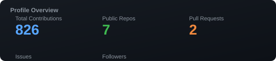
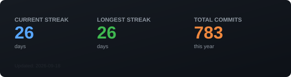
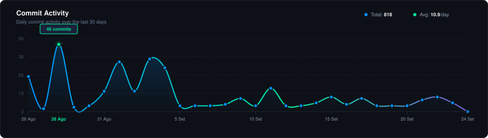
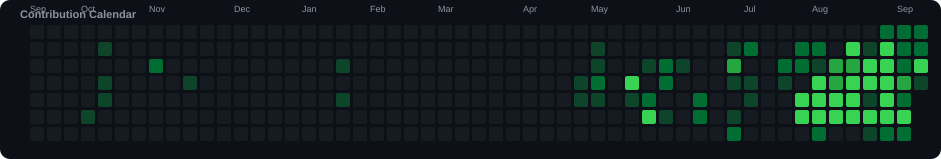

<div align="center">

# 👋 Olá, eu sou o Windson Martins

### Full Stack Developer · Foco em Back-end


`PHP` · `Laravel` · `React` · `JavaScript` · `Python` · `SQL`

Construindo software confiável para problemas reais de negócio — de sistemas críticos e APIs a SaaS, BI e automação.

<p>
  <a href="https://github.com/veruscodes"></a>
  <a href="mailto:codeverus@gmail.com"></a>
  <a href="https://veruscodes.github.io/windsonms/"></a>
</p>

📍 Vitória da Conquista, BA · 🇧🇷 · Aberto a oportunidades remotas, híbridas e presenciais

</div>

---

## 🧑‍💻 Sobre mim

Sou um **Desenvolvedor Full Stack** com foco mais forte em **engenharia back-end**, trabalhando em aplicações que precisam ser úteis, estáveis e sustentáveis em produção.

Minha experiência inclui **sistemas críticos 24/7**, ambientes hospitalares e administrativos, produtos SaaS, dashboards, faturamento, permissões, APIs, integrações e modernização de legado.

Transformo requisitos complexos de negócio em software com arquitetura clara, fluxo de dados confiável e experiência prática ao usuário.

---

## ⚡ O que eu construo

<table>
<tr>
<td width="50%">

### Backend & APIs

- Aplicações PHP / Laravel
- APIs REST e integrações
- Regras de negócio e permissões
- Automação e processos agendados
- Modernização de legado

</td>
<td width="50%">

### Produtos & Dados

- Plataformas SaaS / Multi-tenant
- Dashboards de BI e KPIs
- Sistemas administrativos
- Integração de dados e ETL
- E-commerce e produtos digitais

</td>
</tr>
</table>

---

## 🧰 Tech Stack

<div align="center">


</div>

### Business Intelligence

`TARGIT BI` · `ETL` · `InMemory` · `Scheduler` · `Dashboards` · `Análise de Dados`

---

## 📊 Atividade no GitHub

<div align="center">

<a href="https://github.com/veruscodes">
  
</a>

</div>

<br>

<div align="center">

<a href="https://github.com/veruscodes">
  
</a>

</div>

<br>

<div align="center">

<a href="https://github.com/veruscodes">
  
</a>

</div>

<br>

<div align="center">

<a href="https://github.com/veruscodes">
  
</a>

</div>

> Estatísticas geradas automaticamente via GitHub Actions. Atualizadas a cada 6 horas.

## 🧠 Mentalidade de Engenharia

```text
Problema de negócio
      ↓
Entender o requisito real
      ↓
Projetar uma solução simples e sustentável
      ↓
Construir · integrar · testar
      ↓
Monitorar performance e confiabilidade
      ↓
Melhorar continuamente
```

Valorizo **clareza, confiabilidade, performance, segurança e manutenibilidade** acima de complexidade desnecessária.

---

## 🎯 Foco Profissional

- Desenvolvimento Full Stack com maiorOwnership em back-end
- Sistemas críticos e administrativos
- APIs, integrações e automação
- Arquitetura SaaS e multi-tenancy
- Design e performance de banco de dados
- BI, dashboards e inteligência operacional
- Modernização de aplicações legadas
- Aplicação prática de IA e automação

---

## 🌎 Aberto a oportunidades

Interessado em equipes que buscam alguém com **mentalidade de entrega, organização, visão de produto e experiência prática em engenharia**.

**Remoto · Híbrido · Presencial**

---

## 📫 Vamos nos conectar

<div align="center">

<a href="mailto:codeverus@gmail.com"></a>
<a href="https://github.com/veruscodes"></a>
<a href="https://veruscodes.github.io/windsonms/"></a>

<br><br>

*Transformando necessidades reais em software útil, organizado e escalável.*

</div>
